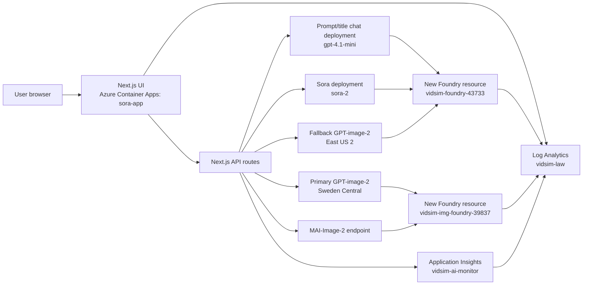
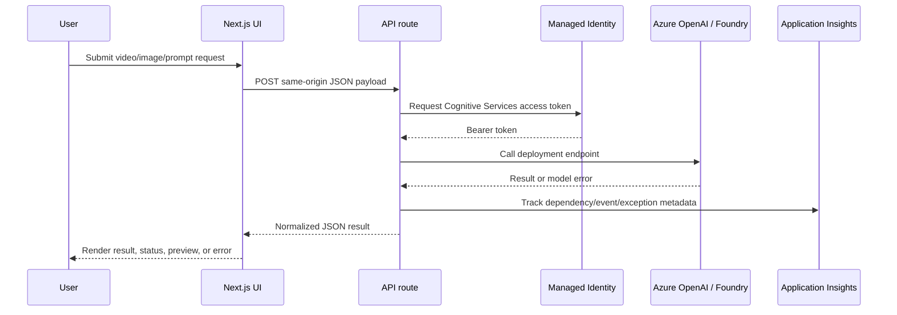
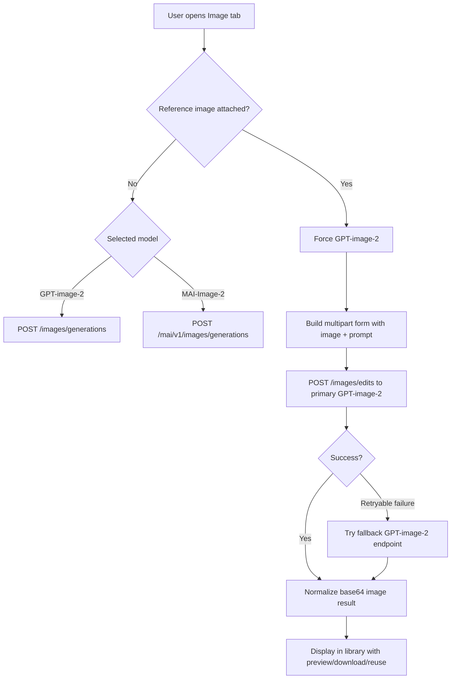
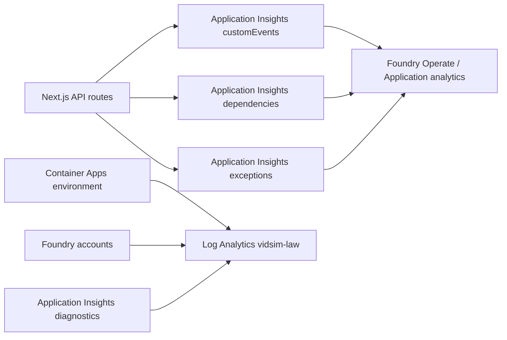

# VidSim Sora and GPT-image-2 Application Specification

## Purpose

This application is a Next.js interface for generating videos with Azure OpenAI Sora and creating images with GPT-image-2 or MAI-Image-2. It is deployed to Azure Container Apps and uses New Microsoft Foundry resources for model deployments, monitoring, and project organization.

## Live deployment

| Area | Value |
| --- | --- |
| Azure resource group | `VidSim` |
| Container App | `sora-app` |
| Container Apps environment | `vidsim-env` |
| Container registry | `vidsimacr56450.azurecr.io` |
| Public URL | `https://sora-app.agreeableglacier-7fe24c12.swedencentral.azurecontainerapps.io/` |
| Primary branch | `gpt-image-2` |

## Functional scope

### Video generation

- Supports Sora video generation through the Azure OpenAI video API.
- Valid video model option is `sora-2`.
- Supports 4, 8, and 12 second video durations.
- Supports landscape and portrait frame sizes.
- Supports optional reference image upload for video generation through `input_reference`.
- Supports remixing existing video IDs.
- Polls generated video status and downloads completed video content.
- Includes automated prompt generation using an Azure OpenAI chat deployment.
- Provides curated video prompt templates, including:
  - A cinematic Generative AI 2025 prompt without reference image.
  - A Thai fresh market character-reference animation prompt with uploaded image guidance.

### Image generation

- Provides a dedicated image generation tab.
- Allows model selection with:
  - `gpt-image-2`
  - `MAI-Image-2`
- Forces GPT-image-2 when a reference image is attached, because the current MAI path does not support uploaded reference images.
- Sends uploaded reference images to GPT-image-2 through the Azure OpenAI `/images/edits` endpoint.
- Sends text-only GPT-image-2 requests through `/images/generations`.
- Preserves exact uploaded reference subjects in prompts, including people, animals, products, objects, logos, props, vehicles, clothing, and scene elements.
- Uses GPT-image-2 prompt templates to prefill and fine-tune user prompts.
- Supports optional public context retrieval for prompt generation.
- Shows generated images in the results/library area and allows preview, reuse as reference, and download.
- Prunes expired generated image results from the library.

### Prompt generation

- Uses Azure OpenAI chat completions to improve video and image prompts.
- Includes selected GPT-image-2 prompt template context for image prompt generation.
- Adds reference-image preservation instructions when an uploaded image is present.
- Does not send generated prompt telemetry content to monitoring.

### Monitoring

- Sends application-level AI events and dependency telemetry to Application Insights.
- Emits telemetry for:
  - Prompt suggestions
  - Video generation
  - Video remix
  - Video status checks
  - Video content downloads
  - Video title generation
  - Image generation
  - GPT-image-2 reference-image edits
  - GPT-image-2 endpoint failover attempts
- Sends Azure resource diagnostic logs and metrics to Log Analytics.

## Explicitly out of scope

- The password login page and static password gate have been removed.
- User accounts, identity provider sign-in, and role-based application authorization are not implemented.
- MAI-Image-2 reference-image editing is not implemented.
- Prompt or uploaded image contents are not written to telemetry.

## Architecture



## Request flow



## Image generation flow



## Video generation flow

```mermaid
flowchart TD
  A[User opens Video tab] --> B[Enter or generate prompt]
  B --> C{Reference image attached?}
  C -- Yes --> D[Create multipart request with input_reference]
  C -- No --> E[Create JSON request]
  D --> F[POST /openai/v1/videos]
  E --> F
  F --> G[Normalize video job]
  G --> H[Poll /openai/v1/videos/{id}]
  H --> I{Completed?}
  I -- No --> H
  I -- Yes --> J[Download /content and preview]
```

## Azure resources

| Resource | Type | Purpose |
| --- | --- | --- |
| `sora-app` | Azure Container App | Hosts the Next.js application. |
| `vidsim-env` | Container Apps managed environment | Runtime environment and platform logs. |
| `vidsimacr56450` | Azure Container Registry | Stores built app container images. |
| `vidsim-foundry-43733` | `Microsoft.CognitiveServices/accounts`, `kind: AIServices` | New Foundry resource for Sora, chat, and fallback GPT-image-2. |
| `vidsim-project` | Foundry project | Default project under `vidsim-foundry-43733`. |
| `vidsim-img-foundry-39837` | `Microsoft.CognitiveServices/accounts`, `kind: AIServices` | New Foundry resource for primary GPT-image-2 and MAI-Image-2. |
| `vidsim-image-project` | Foundry project | Default image project under `vidsim-img-foundry-39837`. |
| `vidsim-ai-monitor` | Application Insights | Application and AI operation telemetry. |
| `vidsim-law` | Log Analytics workspace | Central diagnostics and Application Insights workspace. |

## Model deployments

| Resource | Deployment | Use |
| --- | --- | --- |
| `vidsim-foundry-43733` | `sora-2` | Video generation, polling, remix, and content download. |
| `vidsim-foundry-43733` | `gpt-4.1-mini` | Prompt suggestions and title generation. |
| `vidsim-foundry-43733` | `gpt-image-2` | GPT-image-2 fallback image generation/edit endpoint. |
| `vidsim-img-foundry-39837` | `gpt-image-2` | Primary GPT-image-2 image generation/edit endpoint. |
| `vidsim-img-foundry-39837` | `MAI-Image-2` | MAI image generation without reference image input. |

## API routes

| Route | Method | Purpose |
| --- | --- | --- |
| `/api/generate-video` | `POST` | Creates Sora video jobs, including optional reference image. |
| `/api/videos/[id]` | `GET` | Polls video job status. |
| `/api/videos/[id]/content` | `GET` | Downloads video, thumbnail, or spritesheet content. |
| `/api/remix-video` | `POST` | Creates a remix from an existing video ID. |
| `/api/generate-images` | `POST` | Generates or edits images with GPT-image-2 or MAI-Image-2. |
| `/api/suggest-prompt` | `POST` | Generates or fine-tunes image/video prompts. |
| `/api/video-title` | `POST` | Generates short titles for video prompts. |

## Security controls

- API routes are protected with same-origin checks in middleware:
  - Validates `Origin` or `Referer`.
  - Allows `OPTIONS` preflight.
  - Requires JSON content type for `POST` API calls.
- Azure model calls use managed identity when API keys are not configured.
- Secrets are injected through Azure Container Apps environment variables and secrets.
- Prompt and image content are not logged into Application Insights custom telemetry.

## Environment configuration

| Variable | Purpose |
| --- | --- |
| `AZURE_OPENAI_ENDPOINT` | Foundry/OpenAI endpoint for chat prompt and title generation. |
| `AZURE_OPENAI_API_VERSION` | API version for chat deployment. |
| `AZURE_OPENAI_DEPLOYMENT_NAME` | Chat deployment name. |
| `AZURE_OPENAI_VIDEO_ENDPOINT` | Sora endpoint. |
| `AZURE_OPENAI_VIDEO_API_VERSION` | Sora API version. |
| `AZURE_OPENAI_VIDEO_DEPLOYMENT_NAME` | Sora deployment name. |
| `AZURE_OPENAI_IMAGE_ENDPOINT` | Primary GPT-image-2 endpoint. |
| `AZURE_OPENAI_IMAGE_DEPLOYMENT_NAME` | Primary GPT-image-2 deployment. |
| `AZURE_OPENAI_IMAGE_API_VERSION` | GPT-image-2 API version. |
| `AZURE_OPENAI_IMAGE_FALLBACK_ENDPOINT` | Fallback GPT-image-2 endpoint. |
| `AZURE_OPENAI_IMAGE_FALLBACK_DEPLOYMENT_NAME` | Fallback GPT-image-2 deployment. |
| `AZURE_OPENAI_IMAGE_FALLBACK_API_VERSION` | Fallback GPT-image-2 API version. |
| `AZURE_MAI_ENDPOINT` | MAI endpoint. |
| `AZURE_MAI_IMAGE_DEPLOYMENT_NAME` | MAI deployment name. |
| `APPLICATIONINSIGHTS_CONNECTION_STRING` | Application Insights telemetry ingestion. |
| `NEXT_PUBLIC_APP_URL` | Public app URL used by same-origin middleware allowlist. |

## Monitoring design



Diagnostic settings named `vidsim-law-monitoring` send logs and metrics to `vidsim-law` for:

- `sora-app`
- `vidsim-env`
- `vidsim-foundry-43733`
- `vidsim-img-foundry-39837`
- `vidsim-ai-monitor`

The Foundry projects also have project connections named `vidsimAppInsights` pointing to `vidsim-ai-monitor`.

## Deployment process

1. Build the app with `npm run build`.
2. Build and push a container image to `vidsimacr56450.azurecr.io/sora-app:<tag>`.
3. Update Azure Container App `sora-app` to the new image.
4. Confirm the latest revision is running.
5. Validate at the public URL.
6. Confirm telemetry in Application Insights and Log Analytics.

## Operational notes

- GPT-image-2 capacity is low in the current subscription and may still return Azure 429 overload responses even after using the configured fallback endpoint.
- The app attempts GPT-image-2 failover only for retryable errors and bounded request timeouts.
- Generated image results are client-side library entries and expire automatically.
- Video status and content availability depends on the Sora job lifecycle.
